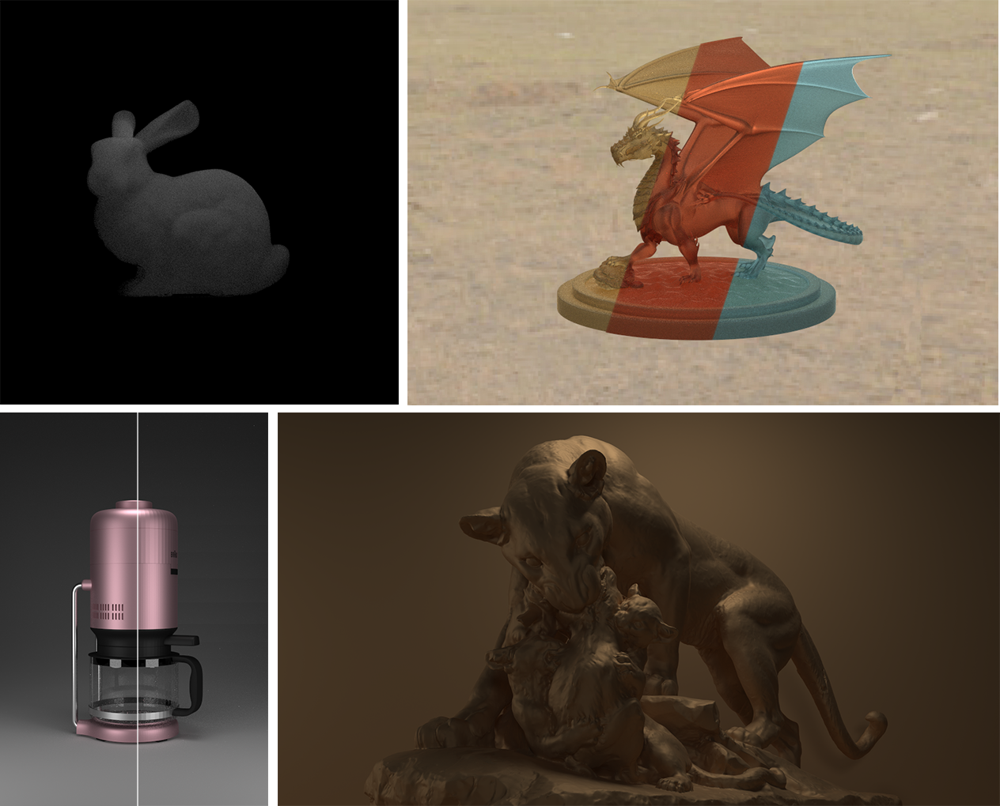
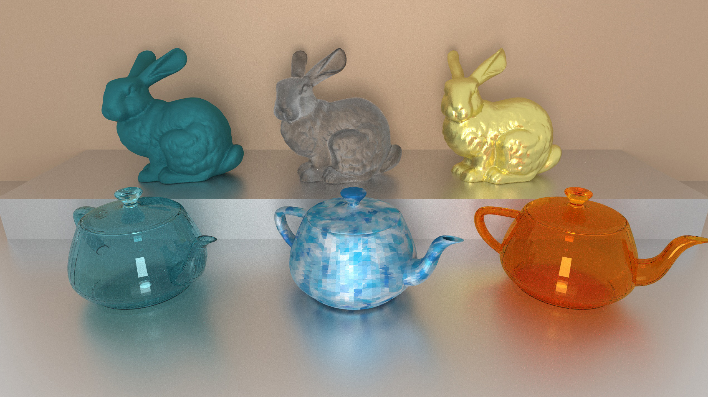
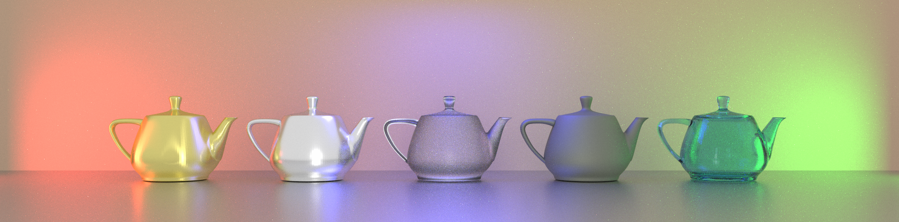
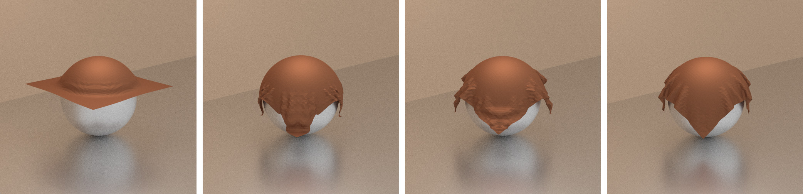

# CUDA Path Tracing

### Gallery

### Model Ref

1. teapot (by Benedikt Bitterli) License: CC0 1.0, https://benedikt-bitterli.me/resources/
1. stanford bunny (by Stanford University Computer Graphics Laboratory) License: Public Domain, https://graphics.stanford.edu/data/3Dscanrep/
1. utah teapot (by Kenzie Lamar, Vicarious Visions) License: CC BY-NC, https://sketchfab.com/3d-models/the-utah-teapot-1092c2832df14099807f66c8b792374d
1. dragon (by Delatronic) License: CC BY 3.0, https://benedikt-bitterli.me/resources/
1. coffee_maker (by cekuhnen) License: CC BY 3.0, https://benedikt-bitterli.me/resources/
1. panther License: CC0 1.0, http://threedscans.com/depot-des-sculptures-de-la-ville-de-paris/panther/